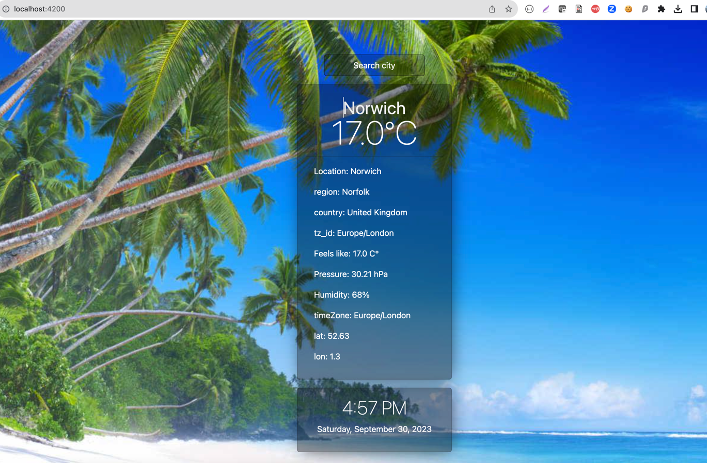
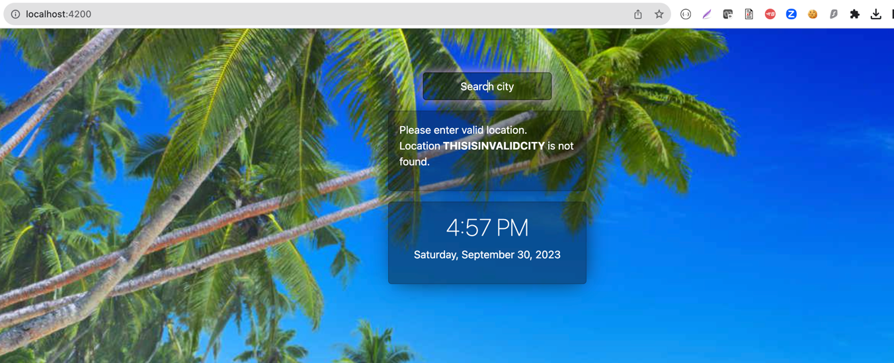

# Weather Information Application - Angular with SpringBoot Integration

This project was generated with [Angular CLI](https://github.com/angular/angular-cli).

## Development server

Run `ng serve` to start the application.
Please navigate to `http://localhost:4200/`.

## Build

Run `ng build` to build the project. The build artifacts will be stored in the `dist/` directory.

## Information about Application
This programme gives weather data based on location search criteria. When a user searches for a valid location on the main page, the programme displays weather information.
 This weather data is provided by a Spring Boot api that accesses a third-party weather API internally. The third-party API can be found at api.weatherapi.com.

The Angular APP is running on http://localhost:4200/
 The Springboot is running on http://localhost:8181/

## User Input and Output
###  Valid Search result of Norwich city 

 
###  Invalid Search result of THISISINVALIDCITY location

## Further help

To get more help on the ngular CLI use `ng help` or go check out the [Angular CLI Overview and Command Reference](https://angular.io/cli) page.
